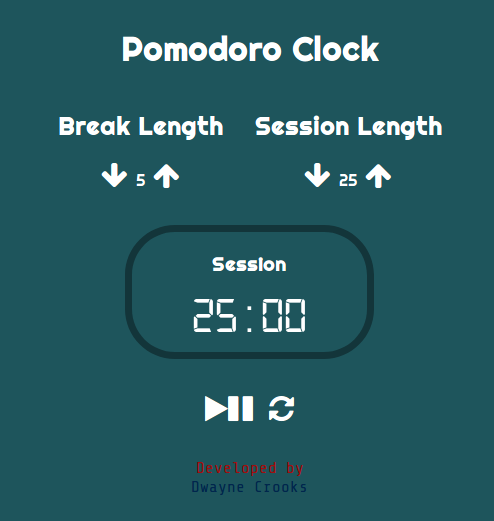

# Pomodoro Clock



Use a timer to help you break down your work into intervals.

Learn more about the
[Pomodoro Technique](https://en.wikipedia.org/wiki/Pomodoro_Technique).

This Elm app is based on [freeCodeCamp](https://www.freecodecamp.com/)'s
[Build a Pomodoro Clock](https://learn.freecodecamp.org/front-end-libraries/front-end-libraries-projects/build-a-pomodoro-clock/)
front-end project. Its look and feel is "borrowed" from
[this example](https://codepen.io/freeCodeCamp/full/XpKrrW) CodePen app.

## Thoughts

In the model, `break`, `session` and `timeLeft` are all `Int`.

```elm
model =
  { break : Int
  , session : Int
  , timeLeft : Int
  }
```

However, since `break` and `session` are specified in minutes and `timeLeft` is
specified in seconds I caused a bug in the application when I needed to set
`timeLeft` to either one of `break` or `session`.

```elm
-- BAD
timeLeft = break

-- GOOD
timeLeft = break * 60
```

I only caught the bug at runtime when using the app. Maybe doing something like
the following,

```elm
model =
  { break : Duration Minutes
  , session : Duration Minutes
  , timeLeft : Duration Seconds
  }
```

would have helped to catch this bug sooner. See this
[talk](https://www.youtube.com/watch?v=WnTw0z7rD3E) for more info on this
approach.

When the timer is running the settings cannot be changed. I initially did it by
simply disabling the appropriate buttons.

```elm
button [ disabled True, onClick LaunchMissiles ] []
```

But, what happens if the user tampers with the UI and enables the button?

```elm
button [ disabled False, onClick LaunchMissiles ] []
```

Since the application logic would be executed it would result in undefined
behaviour because the application logic wasn't expected to be run in such a
case.

That's why I now think that "disabling" the behaviour should be done first in
the application logic and then in the UI. This ensures that even if the user
tampers with the UI the application logic still protects against unwanted
behaviour.

## That's all folks!

Check out the [demo](https://elm-school.github.io/pomodoro-clock/).
